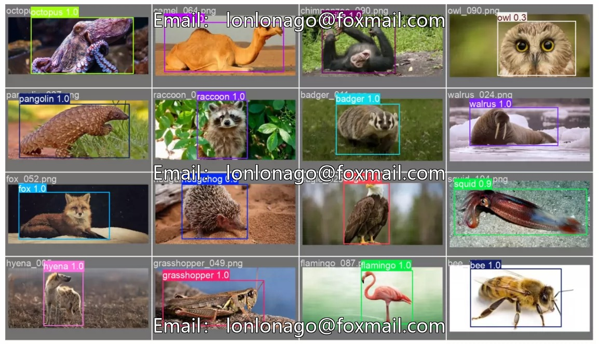
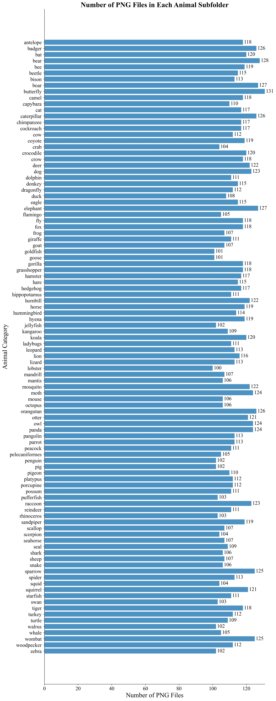
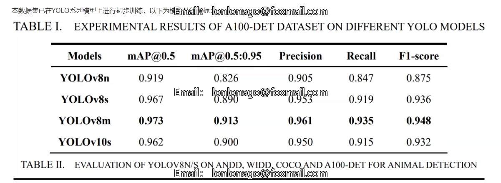
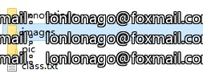
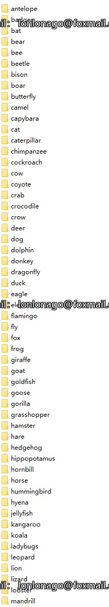
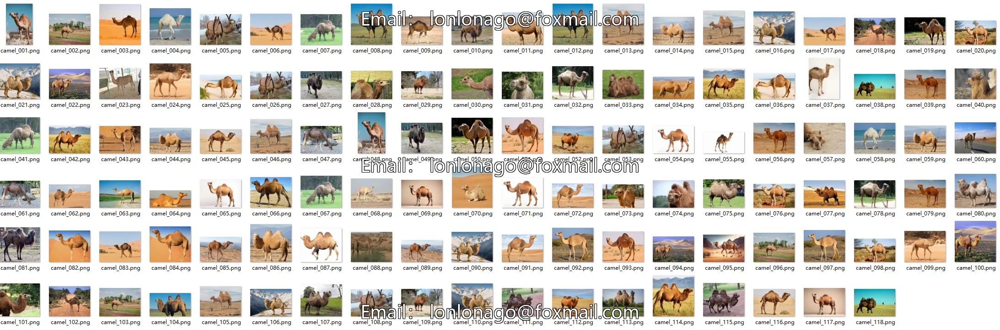
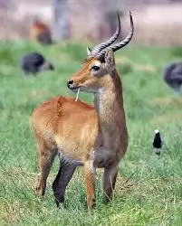

## Body

100 Species Animals Rectangle Box Markup Dataset

Animal Types: 100 (Specific types can be seen in class.txt, sorted by the first letter)
Size: Approximately 7GB
Total Samples: 11354 images
Single-class sample quantity: 100-130 per species
Annotation Type: Rectangle Box (Object Detection)
Annotation Format: X-AnyLabeling - Original JSON format, VOC XML format
Image Format: PNG
Map specific values can be viewed in the product image
Electronic virtual products are non-refundable after sale

## Images

item_1064895181182

Here is a pay link on Stripe ( https://buy.stripe.com/3cs8yP7sY87d0vu9AB ). Please contact me lonlonago@foxmail.com after funding $89, and I will send you a complete data files , thank you!

